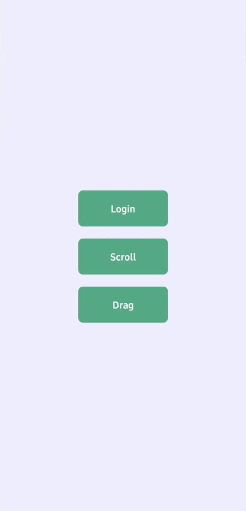
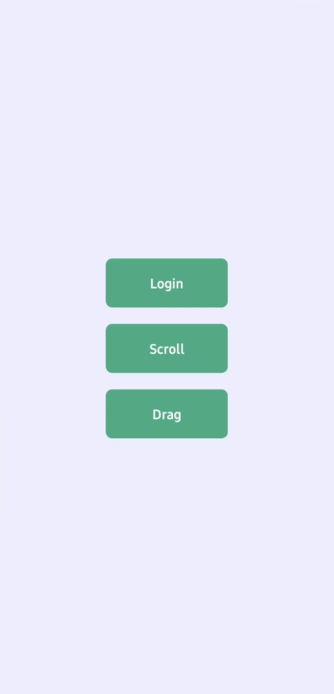
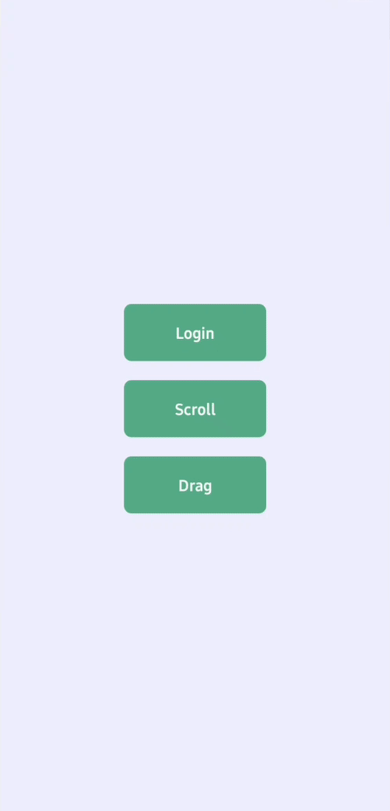

# Reanimated

This is an app to test React Native Reanimated library.  
It contains three screens:

## Login

A page with an Image and Text animations when enter it

## Scroll

A page with a header that shrink when the list scrolls

## Drag

A page with a block that moves around and have two states:

- Green - it will not go back to original position
- Red - it will go back to original position

To toggle states, just double tap it

---

This app was made with Rocketseat's [tutorial](https://youtu.be/6uixYHh7XEc)
